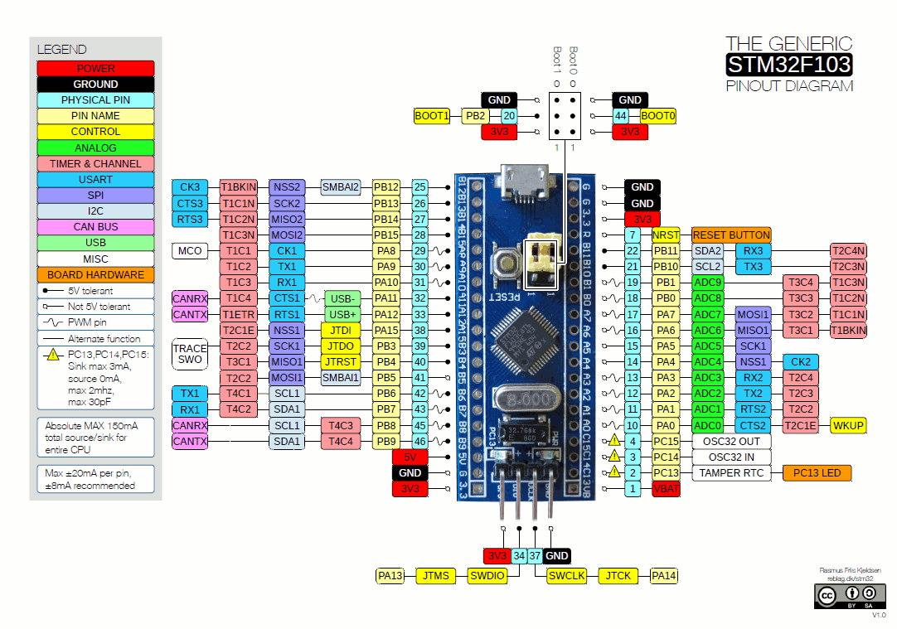

# rust-iot-stm32 (template)

## Template Usage

### Setup new repo

```bash
# Prepare and clone a git repo for your new project
git clone <project_git_uri> my_proj && cd my_proj

# Init a nix flake in the new repo, from the stm32 project template
nix flake init -t "git+ssh://git@gitlab.com/rootlife/apps/deck#templates.rust-iot-stm32"

# Update flake's dependency locks
nix flake update

# Add/Commit/Push
git status
git add .
git commit -m "initial project structure"
git push
```

### Update files

* `flake.nix`, `Cargo.toml` -> Project name.
* `memory.x` -> Memory mappings for your MCU. Some are there, commented. Else see section 4 of your STM32 data sheet.

## Develop

```bash
# Enter project development environment
$ nix develop

# Clean, for good measure
$ cargo clean

# Build, specifying your MCU model by passing the appropriate feature from `Cargo.toml`
$ cargo build --release --features f103
Compiling my_proj v0.1.0 (/home/adrian/ctx/my_proj)
    Finished release [optimized] target(s) in 0.06s

# Assuming a board is connected via an ST-Link adapter
$ cargo flash --chip STM32F103C8 --elf ./target/thumbv7m-none-eabi/release/my_proj
    Flashing ./target/thumbv7m-none-eabi/release/my_proj
     Erasing sectors ✔ [00:00:00] [###]  5.00KiB/ 5.00KiB @ 40.15KiB/s (eta 0s )
 Programming pages   ✔ [00:00:00] [###]  5.00KiB/ 5.00KiB @ 13.91KiB/s (eta 0s )
    Finished in 0.26s 
```

The image should now be executing on the MCU.

Hack on the code and repeat the build/flash cycle as needed.

## Debug

### Attach to target with OpenOCD

Some OpenOCD config examples are provided in the openocd/ directory beneath the project root. 

Find or adapt a config for your scenario.

```bash
$ openocd -f openocd/ocd_stlv2_stm32f1.cfg
Open On-Chip Debugger 0.11.0
Licensed under GNU GPL v2
For bug reports, read
        http://openocd.org/doc/doxygen/bugs.html
WARNING: interface/stlink-v2.cfg is deprecated, please switch to interface/stlink.cfg
Info : auto-selecting first available session transport "hla_swd". To override use 'transport select <transport>'.
Info : The selected transport took over low-level target control. The results might differ compared to plain JTAG/SWD
Info : Listening on port 6666 for tcl connections
Info : Listening on port 4444 for telnet connections
Info : clock speed 1000 kHz
Info : STLINK V2J29S7 (API v2) VID:PID 0483:3748
Info : Target voltage: 3.242942
Info : stm32f1x.cpu: hardware has 6 breakpoints, 4 watchpoints
Info : starting gdb server for stm32f1x.cpu on 3333
Info : Listening on port 3333 for gdb connections
```

Note: OpenOCD will read from openocd.cfg in the current directory, if no `-f` argument is specified, so you might
copy your desired config there to save some typing.

### Connect to OpenOCD from GDB

Fire up GDB in another terminal and connect to the still-running OpenOCD process.

```bash
$ gdb
(gdb) target extended-remote localhost:3333
A program is being debugged already.  Kill it? (y or n) y
Remote debugging using localhost:3333
warning: No executable has been specified and target does not support
determining executable automatically.  Try using the "file" command.
0x080015c0 in ?? ()
```

Load symbols from the executable file, to make it easier to set breakpoints..

```bash
(gdb) file target/thumbv7m-none-eabi/release/rust-iot-stm32
A program is being debugged already.
Are you sure you want to change the file? (y or n) y
Reading symbols from target/thumbv7m-none-eabi/release/rust-iot-stm32...
```

From here you can do GDB things like normal.. Set a (hardware) breakpoint, view registers content, etc:

```bash
(gdb) info registers
r0             0xe010              57360
r1             0x0                 0
r2             0xe000e010          -536813552
r3             0x3                 3
r4             0x20004fd8          536891352
r5             0x40011010          1073811472
r6             0x2000              8192
r7             0x20004fec          536891372
r8             0x20000000          536870912
r9             0x0                 0
r10            0x0                 0
r11            0x0                 0
r12            0x7                 7
sp             0x20004f64          0x20004f64
lr             0x800027d           134218365
pc             0x80007d2           0x80007d2 <stm32f1xx_hal::timer::counter::SysCounterHz::wait+4>
xPSR           0x61000000          1627389952
msp            0x20004f64          0x20004f64
psp            0x0                 0x0
primask        0x0                 0
basepri        0x0                 0
faultmask      0x0                 0
control        0x0                 0
(gdb) thbreak main
Hardware assisted breakpoint 1 at 0x8000192
(gdb) continue
```

### Debug print w/ cortex-m-semihosting

Add the `cortex-m-semihosting` crate to your cargo dependencies, and 
  add some `cortex_m_semihosting::hprintln!` statements to your code.

Then, flash the code and start up OpenOCD and GDB like normal.

On connecting to OpenOCD from GDB, you'll probably see something like this:

```gdb
Remote debugging using :3333
0x08000372 in cortex_m_semihosting::export::hstdout_str ()
```

If you try to continue at this point, you should see that it is unable to:

```gdb
(gdb) load
Loading section .vector_table, size 0x130 lma 0x8000000
Loading section .text, size 0xda4 lma 0x8000130
Loading section .rodata, size 0x30c lma 0x8000ee0
Start address 0x08000130, load size 4576
Transfer rate: 26 KB/sec, 1525 bytes/write.
(gdb) continue
Continuing.

Program received signal SIGTRAP, Trace/breakpoint trap.
0x08000372 in cortex_m_semihosting::export::hstdout_str ()
```

Execution can't proceed until you bring up the semihosting connection.

```gdb
(gdb) monitor arm semihosting enable
semihosting is enabled

(gdb) continue
Continuing.
```

At this point, your code should be executing and the output from your
code's `hprintln!` calls should be output in the OpenOCD console.

## Alternate flashing technique: Flashing using OpenOCD

See `openocd/ocd_stlv2_stm32f1_flash.cfg` for an example of an OpenOCD config that immediately erases and overwrites 
the device flash directly from OpenOCD. This can be handy in the event `cargo flash` is unable to write to the device 
flash for any reason.

`$ openocd -f openocd/ocd_stlv2_stm32f1_flash.cfg`

## NixOS config for ST-Link udev rules

On plugging the ST-Link adapter in, you should be able to find its vendor and product ID in `dmesg` output.

```bash
[214067.773402] usb 1-2: New USB device found, idVendor=0483, idProduct=3748, bcdDevice= 1.00
```

With that info, you can add a udev rule entry via services.udev.extraRules in `configuration.nix`:

```nix
{
    services = {
        udev = {
          extraRules = ''
            # ST-Link
            SUBSYSTEM=="usb", ATTR{idVendor}=="0483", ATTR{idProduct}=="3748", MODE:="666"
          '';
        };
    };
}
```

## Pinouts

### Blue Pill (w/ stm32f103)



## Resources

https://github.com/stm32-rs/stm32-rs

https://docs.rs/stm32f1xx-hal/latest/stm32f1xx_hal/

https://doc.rust-lang.org/cargo/reference/cargo-targets.html

https://docs.rust-embedded.org/discovery/microbit/05-led-roulette/debug-it.html

https://stackoverflow.com/questions/5535110/stm32-gdb-openocd-commands-and-initialization-for-flash-and-ram-debugging

https://docs.rs/cortex-m-semihosting/0.5.0/cortex_m_semihosting/

[yt :: JaJakub :: Rust Embedded for STM32 Microcontrollers: Serial Wire Debug (aka. Hello World)](https://www.youtube.com/watch?v=sPrG4r-zlN4)
